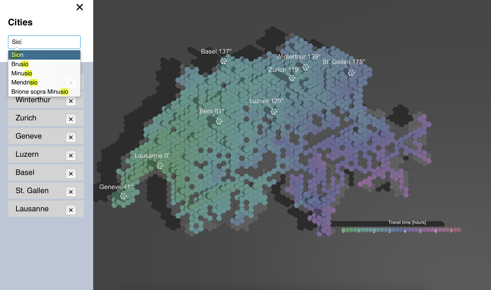

# Switzograms

Switzograms is an interactive isochrone map of the public transport of Switzerland.

Launch your browser on: `visualization/dist/map.html` or live demo also available [here](https://rubenfiszel.github.io/switzograms/visualization/dist/map.html)

## Rebuild from sources

### Build the data

`build_data.sh` will: 

* download the GTFS data
* build the graph
* compute the representative nodes

The data used by the visualizations are all inside the `res` folder.

### Build the visualization

`build_vis.sh` will: 

* download the npm dependencies
* compile the ts source with typescript
* webpack it into `visualizations/dist/bundle.js`.

## About

Our project aims to provide enriched visualizations of the contrast between spatial and temporal distance in Switzerland as well as the population. 
We split the country into equal-sized hexagonal tiles and generate isochrone maps using any given tile as its starting point. This will allow the user to better understand its mobility potential, and restructure its thinking based on temporal and spatial information.
Available Data
We have at our disposal the GTFS data provided by gtfs.geops.ch, geospatial data from opendata.swiss.ch and population information from the Federal Statistical Office website https://www.bfs.admin.ch. 

The GTFS data contains all the transit information of the public transport network of Switzerland. We focused our attention on the schedule data since they provide a way to estimate the time distance between the nodes.

### Hexagonal Map

We combine the map of Switzerland and the transport nodes into a simplified hexagonal map using QGIS, a great software to create and edit geospatial information.  
[screenshot of QGIS]

### Representative nodes

One of the challenges encountered is that a tile contains many nodes. Our tiled map requires a specification for the computation of distance between two tiles. This was achieved by nominating a representative for a given tile to act as its source and target. Of course, the remaining nodes of the tile are still present for the travel computation but only as intermediary steps.
The most relevant representative is the biggest “hub” of the tile (high-traffic, high-speed travel). Slower modes of transportation branch out from this hub. This hub is identified by selecting the node with the highest average daily affluence (when available), otherwise the highest degree of connections amongst all nodes in the tile, when connecting with a subset of nodes of the whole network (important and less important train stations). 

### Time Distance Computation
We pre-compute the matrix representing the time distance from every tile to every tile.
To fill this matrix, we create a weighted directed graph of the public transport nodes of Switzerland.
As explained in the previous section, the time distance between the nodes can be approximated from the GTFS schedule data. The weights of the edge of the graph are calculated using the average daily lapse of time of getting from one node to the next.

Once the graph is obtained, the multipoint Dijkstra algorithm is used to compute the time distance from every representant to every representant. The matrix for the total number of nodes is intractable, but the matrix for the representant is more reasonable: as large as the square of the number of tiles, i.e. approx. 1600x1600:

### Visualization
We use Three.js to display the hexagonal map, a JavaScript 3D graphics framework built on top of WebGL.
The hexagons’ centers are generated with QGIS and their height represents the population, We offer the possibility to add and remove cities from the map through an interactive search bar. 

## Credits

* [Prisca Aeby](https://github.com/paeby)
* [Ruben Fiszel](https://github.com/rubenfiszel)
* [Alexis Semple](https://github.com/)
